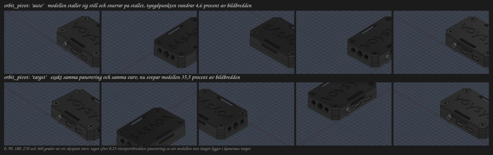

# Axelmatris: vad varje spnav-axel gör med kameran

Uppmätt 2026-09-18 på vanessa (Arch/Omarchy, Hyprland på Wayland), Fusion
2705.1.15 i Wine-prefixet `~/.autodesk_fusion/wineprefixes/default`, dokumentet
`Latency_tester_assembly_v8`, ortografisk kamera, viewport 1261x1223 px.

Två oberoende mätningar ligger till grund:

1. **Fysiskt facit**: en rå spacenavd-inspelning med Elias hand på pucken,
   `tests/fixtures/hardware/calibration_capture.bin`. Den säger vilken axel en
   viss fysisk rörelse hamnar på.
2. **Kamerasvar**: syntetiska enaxel-burstar (`tests/fixtures/axis_matrix.bin`)
   matade genom daemonen i `--replay`-läge medan Fusion körde, avlästa ur
   add-inets `burst start` och `burst end`-rader på loggnivå `debug`.

Ingen siffra nedan är uppskattad.

---

## 1. Fysiskt facit: rörelse till axel

Ur inspelningen, som toppar på 350 counts (fullt utslag) per rörelse:

| Fysisk rörelse | Axel | Topp | Största överhörning |
| --- | --- | --- | --- |
| Skjut pucken åt HÖGER | `x+` | 350 | `z` cirka -42 i medel |
| Skjut pucken FRAMÅT, bort från dig | `z+` | 350 | `rx` cirka +11 |
| Dra pucken RAKT UPP (lyft) | `y+` | 350 | `rz` cirka +52 |
| Tilta framkanten NER | `rx-` | 350 | `rz` cirka +15 |
| Vrid MEDURS sett uppifrån | `ry-` | 350 | `x` cirka +10 |
| FIT-knappen | knapp `5` | tre tryck | |

Överhörningen är verklig men liten: den vinnande axeln bär 4,8 till 24 gånger
runner-upens integral, vilket är varför `tools/calibrate.py` klarar sig med
kravet 2,5 gånger.

**Notera teckenkrocken.** Rotationerna följer högerhandsregeln i ett system med
x åt höger, y uppåt och z **mot användaren** (rx+ lyfter framkanten, ry+ vrider
moturs sett uppifrån). Translationen gör det inte: `z+` är att skjuta pucken
**bort** från användaren. Spacenavd inverterar alltså en av dem i sina
standardinställningar. Det är precis därför Bifrost har en konfigurerbar
axeltabell i stället för hårdkodad teori, och varför kalibreringsverktyget finns.

---

## 2. Kamerasvar per axel

Fixturen håller varje axel på 115 counts i 0,5 s, vilket med `deadzone` 15 och
`full_scale` 350 blir det normaliserade integralet **0,1498 enhetssekunder**.
Mätningen kördes med den mappning som gällde före det här passet
(`pan_x: x`, `pan_y: y`, `dolly: z`, `pitch: rx`, `yaw: ry`, `roll: rz`,
`invert.pan_y: true`), `orbit_pivot: target`, `orbit_speed` 2,5, `pan_speed` 1,0,
`zoom_speed` 1,2, `roll_speed` 0,0.

| Axel | Rörelse i den då gällande mappningen | Kamerasvar | Vad man ser |
| --- | --- | --- | --- |
| `x+` | `pan_x` | kameran 1,287 cm åt vänster (mot `-right`), target följer med | modellen åt HÖGER |
| `x-` | `pan_x` | kameran 1,287 cm åt höger | modellen åt VÄNSTER |
| `y+` | `pan_y` (inverterad) | kameran 1,286 cm uppåt (mot `+up`) | modellen NEDÅT |
| `y-` | `pan_y` (inverterad) | kameran 1,243 cm nedåt (input 0,1448) | modellen UPPÅT |
| `z+` | `dolly` | `viewExtents` 8,5856 till 7,1728, faktor 0,8354 | ZOOM IN |
| `z-` | `dolly` | faktor 1,1970 | ZOOM UT |
| `rx+` | `pitch` | elevation -21,46 grader, `dist` och target oförändrade | kameran NER, man tittar underifrån |
| `rx-` | `pitch` | elevation +20,75 grader (input 0,1449) | kameran UPP, man tittar uppifrån |
| `ry+` | `yaw` | +21,46 grader kring world-Z, alltså moturs sett uppifrån | modellen snurrar MEDURS |
| `ry-` | `yaw` | -21,46 grader | modellen snurrar MOTURS |
| `rz+` | `roll` | ingenting alls, `roll_speed` är 0,0 som standard | inget |
| `rz-` | `roll` | ingenting alls | inget |

Rollen mättes i ett separat pass med `roll_speed` tillfälligt satt till 0,5:
`rz+` roterar kamerans `up`-vektor 4,29 grader mot kamerans `right`, med eye,
target och `dist` orörda, alltså en ren roll kring blickriktningen. Modellen
lutar då moturs på skärmen. Vilken fysisk tippning som ger `rz+` är **härlett,
inte uppmätt**: enligt rotationsramen ovan är det att tippa puckens högerkant
uppåt.

### Beloppen stämmer mot formlerna

Add-inets matte går att räkna efter, och gör det exakt:

* **Panorering**: `belopp = input * pan_speed * synlig världsbredd`.
  0,1498 x 1,0 x 8,5856 cm = 1,286 cm, uppmätt 1,287 cm. Den synliga bredden
  läses med `Viewport.viewToModelSpace` och råkade vid den här viewporten
  (1261x1223, nästan kvadratisk) vara lika med `viewExtents`.
* **Zoom**: `faktor = exp(-input * zoom_speed)`. exp(-0,1498 x 1,2) = 0,8354,
  uppmätt 0,8354.
* **Orbit**: `vinkel = input * orbit_speed`. 0,1498 x 2,5 = 0,3745 rad =
  21,46 grader, uppmätt 21,46 grader.
* **Roll**: `vinkel = input * roll_speed`. 0,1498 x 0,5 = 4,29 grader, uppmätt
  4,29 grader.

Pitch håller radien: `d_dist` är 0,0000 cm i samtliga rotationsburstar, och
target rör sig inte alls när pivoten är `target`.

---

## 3. Mappningen som följer av matrisen

Önskemålet är att **modellen ska följa pucken**: skjut höger, modellen går åt
höger; skjut framåt, modellen går uppåt; tilta framkanten ner, modellen tippar
framkanten ner. Kombinera kolumn 2 i tabell 1 med kolumn 3 i tabell 2:

| Rörelse | Axel | `invert` | Härledning |
| --- | --- | --- | --- |
| `pan_x` | `x` | `false` | höger är `x+`, och positivt `pan_x` flyttar modellen åt höger |
| `pan_y` | `z` | `false` | framåt är `z+`, och positivt `pan_y` flyttar modellen uppåt |
| `dolly` | `y` | `true` | lyft är `y+`, och negativt `dolly` zoomar ut |
| `pitch` | `rx` | `false` | framkanten ner är `rx-`, och negativ pitch lyfter kameran så modellens framkant tippar ner |
| `yaw` | `ry` | `true` | medurs är `ry-`, och positiv yaw svänger kameran moturs så modellen snurrar medurs |
| `roll` | `rz` | `false` | den rotationsaxel som blir över, och `roll_speed` är ändå 0,0 |

Verifierat genom att spela upp de fem riktiga rörelserna ur hårdvaruinspelningen
mot Fusion med den nya mappningen (`sensitivity` tillfälligt 0,1, annars blir
fem sekunder fullt utslag flera varv):

| Rörelse | Uppmätt kamerasvar | Utfall |
| --- | --- | --- |
| skjut höger | kameran 5,17 cm åt vänster | modellen åt höger, rätt |
| skjut framåt | kameran 5,05 cm nedåt | modellen uppåt, rätt |
| lyft | `viewExtents` x1,269 | zoom ut, rätt |
| tilta framkanten ner | elevation +26,64 grader, kameran upp | modellens framkant tippar ner, rätt |
| vrid medurs | +26,21 grader moturs kring world-Z | modellen snurrar medurs, rätt |

Samma uppspelning bekräftar den automatiska rotationspunkten: varje burst loggar
`pivot=model`, och under de två rotationsburstarna flyttar sig target 1,94 cm
respektive 2,99 cm. Target kan bara röra sig om orbiten går kring något annat än
target, alltså kring modellens centrum.

### Rotationspunkten i bild

Add-inets självtest kördes två gånger med `selftest_pan: 0.25`, som skjuter
modellen ur kamerans target innan det skriptade varvet, en gång per pivotläge:



Modellens tyngdpunkt i de fem renderade rutorna vandrar **4,6 procent** av
bildbredden med `orbit_pivot: "auto"` och **35,5 procent** med `"target"`.
Resten av rörelsen i auto-raden är att silhuetten ändrar form när lådan snurrar,
inte att den flyttar sig.

En sak som mätningen avslöjade på vägen: `rootComponent.boundingBox` täcker hela
designen, dolda kroppar inräknade. I ett dokument där något osynligt låg långt
från det man tittade på hamnade pivoten 8 cm fel och modellen svepte ut ur vyn.
Add-inet unionerar därför boxarna för det som faktiskt är synligt, och faller
tillbaka på hela designens box först när det inte finns något synligt att gå på.
Kostnaden är 23 ms för elva synliga objekt, en gång per rörelse.

---

## 4. Vad som fortfarande är obekräftat

* **Zoomriktningen är en smaksak, inte en mätning.** Standard är nu att lyfta
  pucken zoomar UT. Känns det bakvänt är det en enda flagga:
  `addin.invert.dolly` till `false`, eller `python3 tools/calibrate.py
  --zoom-in`.
* **Rotationstecknen är bästa gissning ur "modellen följer pucken".** Riktningen
  är uppmätt, men om pitch eller yaw känns bakvänd i handen är det
  `addin.invert.pitch` respektive `addin.invert.yaw` som flippas. Ingenting
  annat behöver röras.
* **Rollens fysiska riktning är härledd, inte inspelad.** Elias gjorde ingen
  rollrörelse under inspelningen. Rollen är dessutom avstängd (`roll_speed`
  0,0), så den spelar ingen roll förrän den slås på.
* **Överhörningen vid lyft** (`rz` cirka 52 counts i medel) är den största i
  inspelningen. Med `deadzone` 30 ryker den under gränsen, vilket är ett av
  skälen till att deadzone höjdes från 15.

---

## 5. Köra om mätningen

```bash
# fixturerna
python3 tools/make_fixture.py                       # bland annat axis_matrix.bin
python3 tools/make_fixture.py --axis rz --sign -1 --out /tmp/rz.bin

# logga per rörelse i stället för per sekund
# addin.log_level = "debug" i ~/.config/bifrost/config.json

# mata fixturen genom hela kedjan medan Fusion kör
systemctl --user stop bifrost.service
python3 daemon/bifrost_daemon.py --replay tests/fixtures/axis_matrix.bin --replay-wait
systemctl --user start bifrost.service

# läs av
grep "burst " ~/.autodesk_fusion/wineprefixes/default/drive_c/users/$USER/AppData/Local/Temp/bifrost.log
```

`--replay-wait` håller uppspelningen tills add-inet har anslutit, annars spelas
de första burstarna upp för ingen: add-inet backar av upp till fem sekunder
mellan återanslutningsförsöken.

Två fällor som kostade tid under mätningen:

* **Fusion flyttar kameran själv** medan en assembly fortfarande laddar (eye och
  `viewExtents` hoppade till `dist = 10 x extents` mitt i en burst första
  gången). Vänta tills dokumentet är klart, och kasta burstar där `d_dist` inte
  är noll i en ren rotation.
* **Uppspelning komprimerar pauser.** En rå inspelning innehåller inga rutor alls
  medan pucken står stilla, så en fem sekunders paus blir noll sekunder i
  `--replay`. Vill man ha burstgränser i en hårdvaruinspelning får man klistra in
  nollrutor mellan rörelserna.
