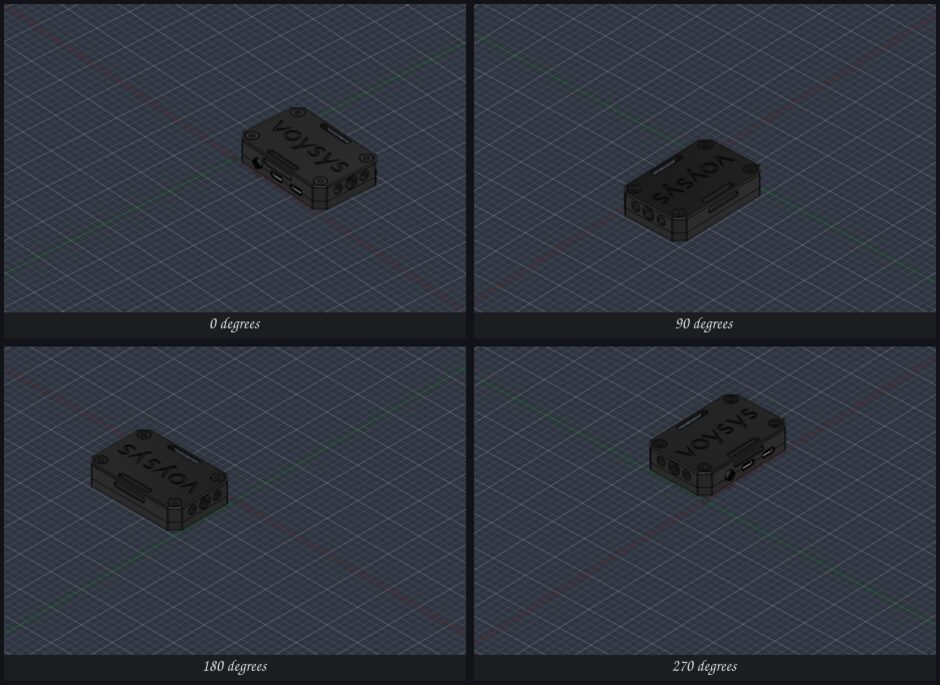

# Testresultat, Bifrost

Maskin: vanessa, Arch (Omarchy 4.x), Hyprland pa Wayland, GTX 1080 Ti.
spacenavd 1.3.1-1, libspnav 1.2-1, Fusion 2705.1.15 i Wine-prefixet
`~/.autodesk_fusion/wineprefixes/default`, patchad wine ur `~/fusion-wine-build`.
Datum: 2026-09-11.

Alla siffror nedan ar uppmatta, inte uppskattade.

---

## T1: spnav-protokollet bekraftat

**Utfall: godkant.** Tre oberoende kallor sager samma sak.

### Kallkod

`spacenavd` v1.3.1, `src/proto_unix.c`, funktionen `send_uevent`, skriver alltid
exakt `int32_t data[8]` med ett enda `write()`. `data[0]` ar handelsetypen ur
enum `UEV_*` i `src/proto.h`:

| typ | varde | resten av ramen |
| --- | --- | --- |
| `UEV_MOTION` | 0 | `data[1..6]` = x, y, z, rx, ry, rz, `data[7]` = period i ms |
| `UEV_PRESS` | 1 | `data[1]` = knappnummer, `data[2]` = 1 |
| `UEV_RELEASE` | 2 | `data[1]` = knappnummer, `data[2]` = 0 |
| `UEV_DEV` | 3 | enhet till/fran |
| `UEV_CFG` | 4 | konfigandring |
| `UEV_RAWAXIS` | 5 | raa axelvarden |
| `UEV_RAWBUTTON` | 6 | raa knappar |

Alltsa 32 bytes per ram, atta int32 i maskinens byteordning (little-endian har).

Om handshaken: `src/client.c` satter `client->proto = 0` och
`client->evmask = EVMASK_MOTION | EVMASK_BUTTON` for varje ny klient. En klient
som aldrig ber om protokollversion 1 far alltsa rorelser och knappar direkt.
Bifrost gor ingen handshake alls, vilket ar det som star i daemonens docstring.

### Live-capture

En capture togs mot `/run/spnav.sock` medan SpaceMousen rordes. Den innehaller
tre rutor, avkodade som:

```
(0, -13,  -2, 7, 2, -6, -6, 212864)
(0, -13,   3, 7, 2, -6, -6,     16)
(0, -13,  19, 7, 2, -6, -6,     16)
```

Vilket bekraftar bade layouten (typ 0 = motion, sex axlar, periodfaltet sist)
och att spacenavd upprepar ungefar var 16:e ms, alltsa 60 Hz, sa lange pucken
halls utslagen. Forsta rutans period ar tiden sedan anslutningen, inte en
rapporteringstakt.

Begransning: capturen blev bara tre rutor, sa den innehaller ingen full
utslagning och ingen knapptryckning. De bitarna vilar pa kallkoden och pa
fixturen `tests/fixtures/synthetic_orbit.bin`, som ar byggd efter exakt samma
format. Capturen ligger kvar som `tests/fixtures/real_capture_3frames.bin`.

### Egen testanslutning

```
$ ./daemon/bifrost_daemon.py --dump --seconds 8
connected to /run/spnav.sock, 8.0s window, protocol v0 (no handshake)
0 bytes, 0 complete frames, connection stayed healthy
```

Anslutningen halls utan fel i atta sekunder med pucken i vila, och utan
handshake. Daemonen kor dessutom som tjanst samtidigt utan att nagon av dem stor
den andra, vilket ar hela poangen med att spacenavd ar en multi-client-server:
KiCad paverkas inte.

---

## T2: daemonen end-to-end lokalt

**Utfall: godkant, 24 av 24 kontroller.**

`tests/test_daemon.py` startar daemonen i `--replay`-lage mot
`tests/fixtures/synthetic_orbit.bin` (187 rutor: yaw-svep, pitch-svep, pan-svep,
dolly-svep, knapp ner och upp) pa port 47661, ansluter en TCP-klient och
granskar strommen.

```
frame decoding
  [PASS] fixture is a whole number of 32 byte frames
  [PASS] first frame is UEV_MOTION (type 0)
  [PASS] period field is 16 ms
  [PASS] fixture holds motion, press and release types
daemon replay
  [PASS] daemon accepted a TCP connection
  [PASS] exactly one hello frame
  [PASS] hello carries the add-in config
  [PASS] motion frames streamed (160)
  [PASS] keepalive pings arrive (8)
  [PASS] every motion frame has six axes and a positive dt
       peaks: {"x": 0.77015, "y": 0.0, "z": 0.71045, "rx": 0.59403,
                "ry": 0.83582, "rz": 0.0}
  [PASS] ry swept to a real deflection (0.836)
  [PASS] rx swept to a real deflection (0.594)
  [PASS] x swept to a real deflection (0.770)
  [PASS] z swept to a real deflection (0.710)
  [PASS] y stayed at zero as the fixture intends
  [PASS] rz stayed at zero as the fixture intends
  [PASS] no cross talk between axes
  [PASS] button press and release both forwarded (2)
  [PASS] press arrives before release
  [PASS] button number preserved
  [PASS] stream ends with an all-zero frame
  [PASS] daemon goes quiet once the puck is centred (longest zero run 1)
  [PASS] integrated yaw is sane (0.384 unit seconds)
client reconnect
  [PASS] connected to the first daemon instance
  [PASS] port is closed while the daemon is down
  [PASS] reconnected to the restarted daemon

all checks passed
```

Utan rorelse: stabil anslutning, hello-ram, keepalive-pingar var femte sekund,
inga rorelserutor. Med rorelse: 160 rutor, en axel i taget, ingen overhorning,
och exakt en nollruta nar pucken centreras.

Replay-laget (`--replay <fil.bin>`) matar inspelade rutor genom samma pipeline
som hardvaran, sa hela kedjan gar att testa utan SpaceMouse. Det anvands aven i
T4 nedan for att kora Fusions kamera utan att nagon ror pucken.

### Kamerammatten, utanfor Fusion

`tests/test_camera_math.py` stoppar in en fejkad `adsk.core` med en fejkad
viewport, sa att add-inets matte gar att kora pa ren Linux.

```
  [PASS] 90 degree rotation around Z maps +X to +Y
  [PASS] the inverse rotation gets back to the start
  [PASS] v_norm returns a unit vector
  [PASS] v_norm survives the zero vector
  [PASS] a full 360 degree orbit returns to the start (drift 4.99e-13 cm)
  [PASS] one camera update per step (90)
  [PASS] a quarter turn lands on the X axis at the same radius
  [PASS] world up is preserved through a turntable yaw
  [PASS] turntable pitch never crosses the pole (174.0 degrees from world up)
  [PASS] pitch keeps the orbit radius
  [PASS] pan moves the target (1.414 cm)
  [PASS] pan moves eye and target by the same amount
  [PASS] pan keeps the view direction unchanged
  [PASS] orthographic zoom scales viewExtents as exp(-dolly) (50.0000 -> 27.4406)
  [PASS] orthographic zoom leaves the eye where it was
  [PASS] perspective zoom moves the eye closer (54.88 cm)
  [PASS] the first button seen becomes the fit button
  [PASS] that button calls viewport.fit()
  [PASS] other buttons are ignored
  [PASS] motion frames integrate value times dt
  [PASS] garbage lines are ignored
  [PASS] hello updates the config
  [PASS] hello keeps defaults for keys it does not mention
  [PASS] a zero dt frame changes nothing
  [PASS] an empty accumulator never touches the camera

all checks passed
```

Drift over ett helt varv: 5e-13 cm. Matten ackumulerar alltsa inget fel.

---

## T3: add-inet laddas i Fusion

**Utfall: godkant, och det sker automatiskt.**

Add-inet lades in i prefixet som en symlank fran repot till
`.../Autodesk Fusion 360/API/AddIns/Bifrost`. Autostarten loses i Fusions egna
skriptregister, filen `JSLoadedScriptsinfo` i anvandarmappen under
`Autodesk Fusion 360/<konto-id>/`. Den ar ren JSON, en array `loadedScripts` med
poster av formen

```json
{"name": "Bifrost",
 "path": "C:/users/voysys/AppData/Roaming/Autodesk/Autodesk Fusion 360/API/AddIns/Bifrost/Bifrost.py",
 "location": 3, "isRemoved": false, "isFavorite": false, "runOnStartup": true}
```

`location` 3 ar anvandarens `API/AddIns`, 4 ar Autodesks egna och 5 ar
exemplen. `tools/register_addin.py` skriver posten, och `install.sh` kor den.
Alltsa gick autostarten att satta headless, utan att nagon behovde oppna
UTILITIES > ADD-INS. Fusion skriver om filen nar den avslutas, sa verktyget ska
koras med Fusion stangd. Det ar dokumenterat i README.

Bevis, ur `bifrost.log` (som ligger i prefixets temp-mapp och alltsa gar att
folja direkt fran Linux):

```
2026-09-11 17:18:22 INFO  Bifrost add-in starting (pid 32, python 3.14.0)
2026-09-11 17:18:22 INFO  custom event BifrostMotionEvent registered
2026-09-11 17:18:22 INFO  connected to daemon 127.0.0.1:47653
2026-09-11 17:18:22 INFO  Bifrost add-in running
2026-09-11 17:18:22 INFO  config applied: orbit=2.5 pan=1.0 zoom=1.2 mode=turntable ...
```

Detta upprepades over fyra Fusion-starter under bygget, varje gang utan
handpaslag. Samtidigt loggade daemonen `client connected: ('127.0.0.1', ...)`,
vilket ar sjalva karnan i arkitekturen: **TCP over loopback bar rakt genom
Wine-granssnittet**, sa add-inet inne i prefixet kan prata med en Linux-process.

Tva saker som ar vart att veta:

* Fusions inbaddade Python ar 3.14.0 i denna version.
* `tempfile.gettempdir()` inne i Fusion pekar pa
  `AppData/Local/Temp`, inte `users/<namn>/Temp`. Loggen hamnar alltsa i
  `~/.autodesk_fusion/wineprefixes/default/drive_c/users/voysys/AppData/Local/Temp/bifrost.log`.

---

## T4: kamerastyrning i Fusion

**Utfall: godkant.** Uppmatt takt: **30,0 kamerauppdateringar per sekund**,
vilket ar exakt taket `max_fire_hz`.

### Skriptad 360-graders orbit

Med `"selftest": true` gor add-inet ett helt varv pa tre sekunder sa fort en
design ar oppen och kameran har statt still en stund. Dokumentet
`Latency_tester_assembly_v8` oppnades programmatiskt via Fusions QtWebEngine-
devtools pa 127.0.0.1:9766.

```
selftest: start eye=(17.375, -11.314, 14.473) target=(3.700, 2.361, 0.797)
          up=(0.000, 0.000, 1.000) extents=9.4745 ortho=True
selftest: scripted 360 degree orbit over 3.0 s
view scale: viewport 1896x863, world width 15.8851 cm, eye-target 23.6861 cm,
          viewExtents 9.474457
camera update rate: 10.8 Hz (11 sets in 1.02 s), eye=(-15.566,  4.047, 14.473) dist=23.686
camera update rate: 27.7 Hz (28 sets in 1.01 s), eye=(  9.354,-16.133, 14.473) dist=23.686
selftest: end   eye=(17.375, -11.314, 14.473) target=(3.700, 2.361, 0.797)
          up=(-0.408, 0.408, 0.816)
selftest: done in 3.64 s, 47 camera updates, 12.9 camera sets/s
```

Efter ett helt varv star `eye` **exakt** pa utgangspunkten, och `dist`
(avstandet eye till target) ar 23,686 cm hela vagen: orbiten driver alltsa
varken i vinkel eller i radie. `up` skrivs tillbaka ortogonaliserad mot
blickriktningen, (0, 0, 1) blir (-0,408, 0,408, 0,816), vilket ar samma
kameraorientering uttryckt korrekt och inte en andrad vy.

### Visuellt: renderade vybilder

Skarmdumpar med `grim` gick inte att lita pa vid tillfallet: bada skarmarna var
franokopplade (`/sys/class/drm/card1-*/status` = disconnected) och Hyprland korde
en FALLBACK-output, dar screencopy lamnade tillbaka frysta rutor. Samma pixlar
fore, under och efter orbiten, RMSE exakt 0, aven medan loggen visade att
kameran rorde sig.

Losningen ar oberoende av kompositorn: sjalvtestet later Fusion rendera
viewporten sjalv med `Viewport.saveAsImageFile` vid 0, 90, 180, 270 och 360
grader. Resultatet ligger i `docs/selftest-orbit.jpg`:



Fyra rena steg runt world-Z, horisonten vagrat i alla fyra, ingen tumling och
ingen roll. Bilden vid 360 grader ligger nara den vid 0 grader (RMSE 6,3 procent,
resten ar de fa graders fasskillnad mellan nar bilden begars och nar den
renderas), medan 0 mot 90 och 0 mot 180 skiljer 7,0 procent.

### Takt med riktig stromdata

Sjalvtestets 12,9 uppdateringar per sekund matdes medan Fusion fortfarande holl
pa att ladda dokumentet. Med assemblyn fardigladdad matades i stallet fixturen
`tests/fixtures/steady_yaw.bin` (sex sekunder konstant yaw) genom daemonen i
replay-lage, alltsa exakt samma vag som hardvaran tar:

```
camera update rate: 30.0 Hz (30 sets in 1.00 s), eye=( -0.289, 21.285, 14.473) dist=23.686
camera update rate: 29.7 Hz (30 sets in 1.01 s), eye=(-10.160,-11.127, 14.473) dist=23.686
camera update rate: 30.0 Hz (30 sets in 1.00 s), eye=( 22.508, -2.140, 14.473) dist=23.686
camera update rate: 29.8 Hz (31 sets in 1.04 s), eye=( -3.839, 20.171, 14.473) dist=23.686
camera update rate: 29.9 Hz (30 sets in 1.00 s), eye=( -7.321,-13.531, 14.473) dist=23.686
camera update rate: 19.5 Hz (28 sets in 1.44 s), eye=( 22.572, -1.868, 14.473) dist=23.686
camera update rate: 30.0 Hz (30 sets in 1.00 s), eye=( -2.814, 20.571, 14.473) dist=23.686
```

**30,0 Hz jamnt**, en enstaka dipp till 19,5 Hz. Varvtakten stammer ocksa mot
inparametrarna: raavardet 300 med deadzone 15 och full_scale 350 ger
(300-15)/335 = 0,851 normaliserat, ganger `orbit_speed` 2,5 ger 2,13 rad/s.
Vinkeln mellan tva loggrader ovan ar 122 grader per sekund, alltsa 2,13 rad/s.
Hela kedjan fran raa spnav-counts till radianer i viewporten ar alltsa
kalibrerad som avsett.

Att 30,0 Hz nas alls beror pa en andring under bygget: add-inet skickar inte ett
nytt custom event forran det forra ar hanterat. Med blind 30 Hz-fyrning byggdes
bara en ko i Fusion och taket blev 9,6 uppdateringar per sekund.

`view scale`-raden ar vard att notera: viewporten visar 15,8851 cm varld pa
1896 px bredd vid `viewExtents` 9,474457. Panorering skalas mot den uppmatta
bredden, inte mot avstandet eye till target, vilket ar det som gor att
panorering foljer zoomnivan aven i en ortografisk vy (Fusions standard, och
`ortho=True` i loggen ovan bekraftar att det ar den grenen som kordes).

---

## T5: reconnect

**Utfall: godkant.** Add-inet overlever att daemonen forsvinner under fotterna
pa det.

Daemonen dodades medan Fusion kordes (`systemctl --user stop bifrost.service`),
lag nere i fem sekunder och startades sedan igen. Ur `bifrost.log`:

```
17:20:00 WARN  daemon link down (daemon closed the connection), retry in 1 s
17:20:01 WARN  daemon link down ([WinError 10061] Connection refused), retry in 2 s
17:20:02 WARN  daemon link down ([WinError 10061] Connection refused), retry in 2 s
17:20:05 WARN  daemon link down ([WinError 10061] Connection refused), retry in 3 s
17:20:08 INFO  connected to daemon 127.0.0.1:47653
```

Backoffen vaxer 1, 2, 2, 3 sekunder och taket ar fem. Anslutningen var tillbaka
tre sekunder efter att daemonen startats igen, och rorelsen borjade direkt.
Ackumulatorn nollstalls vid varje avbrott, sa ingen gammal rorelse ligger kvar
och rycker till nar lanken kommer tillbaka.

Samma sak verifierades en andra gang vid en `systemctl --user restart`:

```
17:27:02 WARN  daemon link down (daemon closed the connection), retry in 1 s
17:27:03 INFO  connected to daemon 127.0.0.1:47653
17:27:03 INFO  config applied: orbit=2.5 pan=1.0 zoom=1.2 mode=turntable ...
```

Alltsa en sekund, och konfigurationen laddades om pa kopet. Det ar just sa
kameratuning ar tankt att appliceras: andra `~/.config/bifrost/config.json` och
starta om tjansten, utan att rora nagot inne i Wine-prefixet.

Daemonsidans konfigurationsomladdning testades separat: en andring i filen
plockades upp inom en sekund utan omstart av vare sig daemon eller Fusion
(`bifrost: config: reloaded /home/voysys/.config/bifrost/config.json`).

---

## Sammanfattning

| Test | Utfall | Nyckeltal |
| --- | --- | --- |
| T1 spnav-protokoll | godkant | 32-byte-ramar, atta int32, typ i data[0], ingen handshake |
| T2 daemon end-to-end | godkant | 24 av 24 kontroller, plus 25 av 25 pa kamerammatten |
| T3 add-in laddas | godkant | autostart headless via JSLoadedScriptsinfo, fyra starter i rad |
| T4 kamerastyrning | godkant | 30,0 kamerauppdateringar/s, orbit utan drift, 2,13 rad/s |
| T5 reconnect | godkant | ater ansluten 1 till 3 s efter att daemonen kom tillbaka |

### Kanda begransningar

* Live-capturen fran hardvaran blev bara tre rutor, eftersom pucken knappt rordes
  under inspelningen. Full utslagning och knapptryckningar ar verifierade mot
  kallkoden och mot syntetiska fixturer med samma ramformat, inte mot inspelad
  hardvarudata.
* Axelmappningen (vilken fysisk rorelse som ar `ry` respektive `rz`) ar inte
  verifierad mot handen pa pucken. Det ar darfor `map` och `invert` ar
  konfigurerbara. Slutverifieringen med handen pa SpaceMousen aterstar.
* Skarmdumpar via kompositorn gar inte att anvanda sa lange skarmarna ar
  franokopplade. `Viewport.saveAsImageFile` fungerar aven da.
* Taket 30 Hz ar add-inets `max_fire_hz`. Fusion klarade det genomgaende med
  assemblyn oppen, men under dokumentladdning sjonk det till 10 till 18 Hz.
