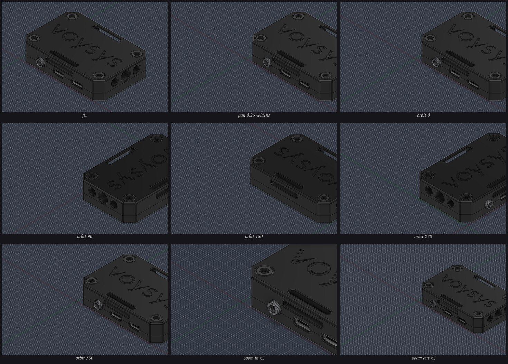

# Testresultat, Bifrost

Maskin: vanessa, Arch (Omarchy 4.x), Hyprland pa Wayland, GTX 1080 Ti.
spacenavd 1.3.1-1, libspnav 1.2-1, Fusion 2705.1.15 i Wine-prefixet
`~/.autodesk_fusion/wineprefixes/default`, patchad wine ur `~/fusion-wine-build`.
Datum: 2026-09-11 (T1 till T5) och 2026-09-18 (T6a, T6b, T7 och T8).

Alla siffror nedan ar uppmatta, inte uppskattade.

---

## T1: spnav-protokollet bekraftat

**Utfall: godkant.** Tre oberoende kallor sager samma sak.

### Kallkod

`spacenavd` v1.3.1, `src/proto_unix.c`, funktionen `send_uevent`, skriver alltid
exakt `int32_t data[8]` med ett enda `write()`. `data[0]` ar handelsetypen ur
enum `UEV_*` i `src/proto.h`:

| typ | varde | resten av ramen |
| --- | --- | --- |
| `UEV_MOTION` | 0 | `data[1..6]` = x, y, z, rx, ry, rz, `data[7]` = period i ms |
| `UEV_PRESS` | 1 | `data[1]` = knappnummer, `data[2]` = 1 |
| `UEV_RELEASE` | 2 | `data[1]` = knappnummer, `data[2]` = 0 |
| `UEV_DEV` | 3 | enhet till/fran |
| `UEV_CFG` | 4 | konfigandring |
| `UEV_RAWAXIS` | 5 | raa axelvarden |
| `UEV_RAWBUTTON` | 6 | raa knappar |

Alltsa 32 bytes per ram, atta int32 i maskinens byteordning (little-endian har).

Om handshaken: `src/client.c` satter `client->proto = 0` och
`client->evmask = EVMASK_MOTION | EVMASK_BUTTON` for varje ny klient. En klient
som aldrig ber om protokollversion 1 far alltsa rorelser och knappar direkt.
Bifrost gor ingen handshake alls, vilket ar det som star i daemonens docstring.

### Live-capture

En capture togs mot `/run/spnav.sock` medan SpaceMousen rordes. Den innehaller
tre rutor, avkodade som:

```
(0, -13,  -2, 7, 2, -6, -6, 212864)
(0, -13,   3, 7, 2, -6, -6,     16)
(0, -13,  19, 7, 2, -6, -6,     16)
```

Vilket bekraftar bade layouten (typ 0 = motion, sex axlar, periodfaltet sist)
och att spacenavd upprepar ungefar var 16:e ms, alltsa 60 Hz, sa lange pucken
halls utslagen. Forsta rutans period ar tiden sedan anslutningen, inte en
rapporteringstakt.

Begransning: capturen blev bara tre rutor, sa den innehaller ingen full
utslagning och ingen knapptryckning. De bitarna vilar pa kallkoden och pa
fixturen `tests/fixtures/synthetic_orbit.bin`, som ar byggd efter exakt samma
format. Capturen ligger kvar som `tests/fixtures/real_capture_3frames.bin`.

### Egen testanslutning

```
$ ./daemon/bifrost_daemon.py --dump --seconds 8
connected to /run/spnav.sock, 8.0s window, protocol v0 (no handshake)
0 bytes, 0 complete frames, connection stayed healthy
```

Anslutningen halls utan fel i atta sekunder med pucken i vila, och utan
handshake. Daemonen kor dessutom som tjanst samtidigt utan att nagon av dem stor
den andra, vilket ar hela poangen med att spacenavd ar en multi-client-server:
KiCad paverkas inte.

---

## T2: daemonen end-to-end lokalt

**Utfall: godkant, 24 av 24 kontroller.**

`tests/test_daemon.py` startar daemonen i `--replay`-lage mot
`tests/fixtures/synthetic_orbit.bin` (187 rutor: yaw-svep, pitch-svep, pan-svep,
dolly-svep, knapp ner och upp) pa port 47661, ansluter en TCP-klient och
granskar strommen.

```
frame decoding
  [PASS] fixture is a whole number of 32 byte frames
  [PASS] first frame is UEV_MOTION (type 0)
  [PASS] period field is 16 ms
  [PASS] fixture holds motion, press and release types
daemon replay
  [PASS] daemon accepted a TCP connection
  [PASS] exactly one hello frame
  [PASS] hello carries the add-in config
  [PASS] motion frames streamed (160)
  [PASS] keepalive pings arrive (8)
  [PASS] every motion frame has six axes and a positive dt
       peaks: {"x": 0.77015, "y": 0.0, "z": 0.71045, "rx": 0.59403,
                "ry": 0.83582, "rz": 0.0}
  [PASS] ry swept to a real deflection (0.836)
  [PASS] rx swept to a real deflection (0.594)
  [PASS] x swept to a real deflection (0.770)
  [PASS] z swept to a real deflection (0.710)
  [PASS] y stayed at zero as the fixture intends
  [PASS] rz stayed at zero as the fixture intends
  [PASS] no cross talk between axes
  [PASS] button press and release both forwarded (2)
  [PASS] press arrives before release
  [PASS] button number preserved
  [PASS] stream ends with an all-zero frame
  [PASS] daemon goes quiet once the puck is centred (longest zero run 1)
  [PASS] integrated yaw is sane (0.384 unit seconds)
client reconnect
  [PASS] connected to the first daemon instance
  [PASS] port is closed while the daemon is down
  [PASS] reconnected to the restarted daemon

all checks passed
```

Utan rorelse: stabil anslutning, hello-ram, keepalive-pingar var femte sekund,
inga rorelserutor. Med rorelse: 160 rutor, en axel i taget, ingen overhorning,
och exakt en nollruta nar pucken centreras.

Replay-laget (`--replay <fil.bin>`) matar inspelade rutor genom samma pipeline
som hardvaran, sa hela kedjan gar att testa utan SpaceMouse. Det anvands aven i
T4 nedan for att kora Fusions kamera utan att nagon ror pucken.

### Kamerammatten, utanfor Fusion

`tests/test_camera_math.py` stoppar in en fejkad `adsk.core` med en fejkad
viewport, sa att add-inets matte gar att kora pa ren Linux.

```
  [PASS] 90 degree rotation around Z maps +X to +Y
  [PASS] the inverse rotation gets back to the start
  [PASS] v_norm returns a unit vector
  [PASS] v_norm survives the zero vector
  [PASS] a full 360 degree orbit returns to the start (drift 4.99e-13 cm)
  [PASS] one camera update per step (90)
  [PASS] a quarter turn lands on the X axis at the same radius
  [PASS] world up is preserved through a turntable yaw
  [PASS] turntable pitch never crosses the pole (174.0 degrees from world up)
  [PASS] pitch keeps the orbit radius
  [PASS] pan moves the target (1.414 cm)
  [PASS] pan moves eye and target by the same amount
  [PASS] pan keeps the view direction unchanged
  [PASS] orthographic zoom scales viewExtents as exp(-dolly) (50.0000 -> 27.4406)
  [PASS] orthographic zoom leaves the eye where it was
  [PASS] perspective zoom moves the eye closer (54.88 cm)
  [PASS] the first button seen becomes the fit button
  [PASS] that button calls viewport.fit()
  [PASS] other buttons are ignored
  [PASS] motion frames integrate value times dt
  [PASS] garbage lines are ignored
  [PASS] hello updates the config
  [PASS] hello keeps defaults for keys it does not mention
  [PASS] a zero dt frame changes nothing
  [PASS] an empty accumulator never touches the camera

all checks passed
```

Drift over ett helt varv: 5e-13 cm. Matten ackumulerar alltsa inget fel.

---

## T3: add-inet laddas i Fusion

**Utfall: godkant, och det sker automatiskt.**

Add-inet lades in i prefixet som en symlank fran repot till
`.../Autodesk Fusion 360/API/AddIns/Bifrost`. Autostarten loses i Fusions egna
skriptregister, filen `JSLoadedScriptsinfo` i anvandarmappen under
`Autodesk Fusion 360/<konto-id>/`. Den ar ren JSON, en array `loadedScripts` med
poster av formen

```json
{"name": "Bifrost",
 "path": "C:/users/voysys/AppData/Roaming/Autodesk/Autodesk Fusion 360/API/AddIns/Bifrost/Bifrost.py",
 "location": 3, "isRemoved": false, "isFavorite": false, "runOnStartup": true}
```

`location` 3 ar anvandarens `API/AddIns`, 4 ar Autodesks egna och 5 ar
exemplen. `tools/register_addin.py` skriver posten, och `install.sh` kor den.
Alltsa gick autostarten att satta headless, utan att nagon behovde oppna
UTILITIES > ADD-INS. Fusion skriver om filen nar den avslutas, sa verktyget ska
koras med Fusion stangd. Det ar dokumenterat i README.

Bevis, ur `bifrost.log` (som ligger i prefixets temp-mapp och alltsa gar att
folja direkt fran Linux):

```
2026-09-11 17:18:22 INFO  Bifrost add-in starting (pid 32, python 3.14.0)
2026-09-11 17:18:22 INFO  custom event BifrostMotionEvent registered
2026-09-11 17:18:22 INFO  connected to daemon 127.0.0.1:47653
2026-09-11 17:18:22 INFO  Bifrost add-in running
2026-09-11 17:18:22 INFO  config applied: orbit=2.5 pan=1.0 zoom=1.2 mode=turntable ...
```

Detta upprepades over fyra Fusion-starter under bygget, varje gang utan
handpaslag. Samtidigt loggade daemonen `client connected: ('127.0.0.1', ...)`,
vilket ar sjalva karnan i arkitekturen: **TCP over loopback bar rakt genom
Wine-granssnittet**, sa add-inet inne i prefixet kan prata med en Linux-process.

Tva saker som ar vart att veta:

* Fusions inbaddade Python ar 3.14.0 i denna version.
* `tempfile.gettempdir()` inne i Fusion pekar pa
  `AppData/Local/Temp`, inte `users/<namn>/Temp`. Loggen hamnar alltsa i
  `~/.autodesk_fusion/wineprefixes/default/drive_c/users/voysys/AppData/Local/Temp/bifrost.log`.

---

## T4: kamerastyrning i Fusion

**Utfall: godkant.** Uppmatt takt: **30,0 kamerauppdateringar per sekund**,
vilket ar exakt taket `max_fire_hz`.

### Skriptad 360-graders orbit

Med `"selftest": true` gor add-inet ett helt varv pa tre sekunder sa fort en
design ar oppen och kameran har statt still en stund. Dokumentet
`Latency_tester_assembly_v8` oppnades programmatiskt via Fusions QtWebEngine-
devtools pa 127.0.0.1:9766.

```
selftest: start eye=(17.375, -11.314, 14.473) target=(3.700, 2.361, 0.797)
          up=(0.000, 0.000, 1.000) extents=9.4745 ortho=True
selftest: scripted 360 degree orbit over 3.0 s
view scale: viewport 1896x863, world width 15.8851 cm, eye-target 23.6861 cm,
          viewExtents 9.474457
camera update rate: 10.8 Hz (11 sets in 1.02 s), eye=(-15.566,  4.047, 14.473) dist=23.686
camera update rate: 27.7 Hz (28 sets in 1.01 s), eye=(  9.354,-16.133, 14.473) dist=23.686
selftest: end   eye=(17.375, -11.314, 14.473) target=(3.700, 2.361, 0.797)
          up=(-0.408, 0.408, 0.816)
selftest: done in 3.64 s, 47 camera updates, 12.9 camera sets/s
```

Efter ett helt varv star `eye` **exakt** pa utgangspunkten, och `dist`
(avstandet eye till target) ar 23,686 cm hela vagen: orbiten driver alltsa
varken i vinkel eller i radie. `up` skrivs tillbaka ortogonaliserad mot
blickriktningen, (0, 0, 1) blir (-0,408, 0,408, 0,816), vilket ar samma
kameraorientering uttryckt korrekt och inte en andrad vy.

### Visuellt: renderade vybilder

Skarmdumpar med `grim` gick inte att lita pa vid tillfallet: bada skarmarna var
franokopplade (`/sys/class/drm/card1-*/status` = disconnected) och Hyprland korde
en FALLBACK-output, dar screencopy lamnade tillbaka frysta rutor. Samma pixlar
fore, under och efter orbiten, RMSE exakt 0, aven medan loggen visade att
kameran rorde sig.

Losningen ar oberoende av kompositorn: sjalvtestet later Fusion rendera
viewporten sjalv med `Viewport.saveAsImageFile` vid 0, 90, 180, 270 och 360
grader. Resultatet ligger i `docs/selftest-orbit.jpg`:


Fyra rena steg runt world-Z, horisonten vagrat i alla fyra, ingen tumling och
ingen roll. Bilden vid 360 grader ligger nara den vid 0 grader (RMSE 6,3 procent,
resten ar de fa graders fasskillnad mellan nar bilden begars och nar den
renderas), medan 0 mot 90 och 0 mot 180 skiljer 7,0 procent.

### Takt med riktig stromdata

Sjalvtestets 12,9 uppdateringar per sekund matdes medan Fusion fortfarande holl
pa att ladda dokumentet. Med assemblyn fardigladdad matades i stallet fixturen
`tests/fixtures/steady_yaw.bin` (sex sekunder konstant yaw) genom daemonen i
replay-lage, alltsa exakt samma vag som hardvaran tar:

```
camera update rate: 30.0 Hz (30 sets in 1.00 s), eye=( -0.289, 21.285, 14.473) dist=23.686
camera update rate: 29.7 Hz (30 sets in 1.01 s), eye=(-10.160,-11.127, 14.473) dist=23.686
camera update rate: 30.0 Hz (30 sets in 1.00 s), eye=( 22.508, -2.140, 14.473) dist=23.686
camera update rate: 29.8 Hz (31 sets in 1.04 s), eye=( -3.839, 20.171, 14.473) dist=23.686
camera update rate: 29.9 Hz (30 sets in 1.00 s), eye=( -7.321,-13.531, 14.473) dist=23.686
camera update rate: 19.5 Hz (28 sets in 1.44 s), eye=( 22.572, -1.868, 14.473) dist=23.686
camera update rate: 30.0 Hz (30 sets in 1.00 s), eye=( -2.814, 20.571, 14.473) dist=23.686
```

**30,0 Hz jamnt**, en enstaka dipp till 19,5 Hz. Varvtakten stammer ocksa mot
inparametrarna: raavardet 300 med deadzone 15 och full_scale 350 ger
(300-15)/335 = 0,851 normaliserat, ganger `orbit_speed` 2,5 ger 2,13 rad/s.
Vinkeln mellan tva loggrader ovan ar 122 grader per sekund, alltsa 2,13 rad/s.
Hela kedjan fran raa spnav-counts till radianer i viewporten ar alltsa
kalibrerad som avsett.

Att 30,0 Hz nas alls beror pa en andring under bygget: add-inet skickar inte ett
nytt custom event forran det forra ar hanterat. Med blind 30 Hz-fyrning byggdes
bara en ko i Fusion och taket blev 9,6 uppdateringar per sekund.

`view scale`-raden ar vard att notera: viewporten visar 15,8851 cm varld pa
1896 px bredd vid `viewExtents` 9,474457. Panorering skalas mot den uppmatta
bredden, inte mot avstandet eye till target, vilket ar det som gor att
panorering foljer zoomnivan aven i en ortografisk vy (Fusions standard, och
`ortho=True` i loggen ovan bekraftar att det ar den grenen som kordes).

---

## T5: reconnect

**Utfall: godkant.** Add-inet overlever att daemonen forsvinner under fotterna
pa det.

Daemonen dodades medan Fusion kordes (`systemctl --user stop bifrost.service`),
lag nere i fem sekunder och startades sedan igen. Ur `bifrost.log`:

```
17:20:00 WARN  daemon link down (daemon closed the connection), retry in 1 s
17:20:01 WARN  daemon link down ([WinError 10061] Connection refused), retry in 2 s
17:20:02 WARN  daemon link down ([WinError 10061] Connection refused), retry in 2 s
17:20:05 WARN  daemon link down ([WinError 10061] Connection refused), retry in 3 s
17:20:08 INFO  connected to daemon 127.0.0.1:47653
```

Backoffen vaxer 1, 2, 2, 3 sekunder och taket ar fem. Anslutningen var tillbaka
tre sekunder efter att daemonen startats igen, och rorelsen borjade direkt.
Ackumulatorn nollstalls vid varje avbrott, sa ingen gammal rorelse ligger kvar
och rycker till nar lanken kommer tillbaka.

Samma sak verifierades en andra gang vid en `systemctl --user restart`:

```
17:27:02 WARN  daemon link down (daemon closed the connection), retry in 1 s
17:27:03 INFO  connected to daemon 127.0.0.1:47653
17:27:03 INFO  config applied: orbit=2.5 pan=1.0 zoom=1.2 mode=turntable ...
```

Alltsa en sekund, och konfigurationen laddades om pa kopet. Det ar just sa
kameratuning ar tankt att appliceras: andra `~/.config/bifrost/config.json` och
starta om tjansten, utan att rora nagot inne i Wine-prefixet.

Daemonsidans konfigurationsomladdning testades separat: en andring i filen
plockades upp inom en sekund utan omstart av vare sig daemon eller Fusion
(`bifrost: config: reloaded /home/voysys/.config/bifrost/config.json`).

---

## T6a: axelmatris, mappning och rotationspunkt (2026-09-18)

**Utfall: godkant.** Passet gjorde fyra saker, alla mot en korande Fusion med
dokumentet `Latency_tester_assembly_v8` oppet.

### Axelmatrisen

Fixturen `tests/fixtures/axis_matrix.bin` (tolv enaxelburstar, 115 counts i 0,5 s
per burst, alltsa det normaliserade integralet 0,1498) matades genom daemonen i
`--replay --replay-wait`-lage. Add-inet loggar sedan detta passet en rad fore och
en rad efter varje rorelse pa nivan `debug`, sa varje axels kamerasvar gar att
lasa av exakt. Hela tabellen med belopp och harledningar ligger i
[AXELMATRIS.md](AXELMATRIS.md). Kortversionen:

| Axel | Kamerasvar vid input 0,1498 |
| --- | --- |
| `x` | panorering 1,287 cm i sidled |
| `y` | panorering 1,286 cm i hojdled |
| `z` | zoom, `viewExtents` ganger 0,8354 |
| `rx` | pitch 21,46 grader, radien orord |
| `ry` | yaw 21,46 grader kring world-Z |
| `rz` | ingenting, `roll_speed` ar 0,0 (med 0,5: roll 4,29 grader) |

Beloppen stammer exakt mot formlerna: `input * pan_speed * synlig bredd`,
`exp(-input * zoom_speed)` och `input * orbit_speed`.

### Fysiskt facit och den nya mappningen

En ra spacenavd-inspelning med handen pa pucken ligger nu i repot som
`tests/fixtures/hardware/calibration_capture.bin` (2004 rutor, 42 s, toppar pa
350 counts). Den ger facit: hoger ar `x+`, framat ar `z+`, lyft ar `y+`,
framkanten ner ar `rx-`, medurs sett uppifran ar `ry-`, FIT-knappen ar nummer 5.

Mappningen `pan_x: x`, `pan_y: z`, `dolly: y` med `invert.dolly` och `invert.yaw`
sanna verifierades genom att spela upp de fem riktiga rorelserna mot Fusion:

| Rorelse | Uppmatt | Utfall |
| --- | --- | --- |
| skjut hoger | kameran 5,17 cm at vanster | modellen at hoger, ratt |
| skjut framat | kameran 5,05 cm nedat | modellen uppat, ratt |
| lyft | `viewExtents` ganger 1,269 | zoom ut, ratt |
| tilta framkanten ner | elevation +26,64 grader | modellens framkant ner, ratt |
| vrid medurs | +26,21 grader moturs kring world-Z | modellen medurs, ratt |

### Autocentrerad rotationspunkt

Med `orbit_pivot: "auto"` loggade varje burst `pivot=model`, och under de tva
rotationsburstarna flyttade sig kamerans target 1,94 respektive 2,99 cm. Target
kan bara rora sig om orbiten gar kring nagot annat an target, alltsa kring
modellens boundingbox-centrum. Uppslaget kostar 1 till 23 ms per rorelse.

Bildbevis: sjalvtestet kordes tva ganger med `selftest_pan: 0.25`, som skjuter
modellen ur target innan det skriptade varvet, en gang per pivotlage.


Modellens tyngdpunkt i de fem renderade rutorna vandrar **4,6 procent** av
bildbredden med `"auto"` och **35,5 procent** med `"target"`. Resten av rorelsen
i auto-raden ar att silhuetten andrar form nar ladan snurrar.

Forsta forsoket misslyckades pa ett larorikt satt: `rootComponent.boundingBox`
tacker hela designen, dolda kroppar inraknade, och i ett dokument dar nagot
osynligt lag langt bort hamnade pivoten 8 cm fel sa att modellen svepte ut ur
vyn anda. Add-inet unionerar darfor boxarna for det som faktiskt ar synligt
(elva objekt, 23 ms i det har dokumentet) och tar hela designens box forst nar
inget synligt finns.

### Kalibreringsverktyget

`tools/calibrate.py` kort over samma inspelning (`--replay`) hittar de fem
rorelserna, plockar ratt axel och tecken i alla fem, laser av knapp 5, och
producerar exakt den mappning som repot nu skeppar. Det ar en oberoende
harledning av samma svar som matrisen gav for hand.

```
5 movements found in calibration_capture.bin
  pan_x  x      +      peak  +350  ratio   5.5  ok
  pan_y  z      +      peak  +350  ratio  22.1  ok
  dolly  y      +      peak  +350  ratio   4.8  ok
  pitch  rx     -      peak  -350  ratio  16.8  ok
  yaw    ry     -      peak  -350  ratio  23.9  ok
  fit    button 5 (3 presses seen)
```

`tests/test_calibrate.py`: 37 av 37 kontroller grona, varav elva mot den riktiga
inspelningen. `tests/test_camera_math.py` vaxte fran 25 till 42 kontroller med
pivot- och burstlogiken inraknad, `tests/test_daemon.py` gar pa 26.

### Tva fallgropar som kostade tid

* **Fusion flyttar kameran sjalv** medan en assembly laddar. Forsta matningen
  fick `dist` att hoppa fran 23,7 till 147,7 cm mitt i en burst, utan nagon
  input. Matningen gjordes om nar dokumentet stod stilla.
* **Uppspelning komprimerar pauser.** En ra inspelning innehaller inga rutor alls
  medan pucken star stilla, sa hela hardvaruinspelningen blev en enda burst i
  `--replay`. Rorelserna klipptes darfor isar med nollrutor emellan.

---

## T7: kanslofixen (2026-09-18)

**Utfall: godkant.** T6b kordes med handen pa pucken och domen blev "fungerar
jattedaligt". Loggen fran det passet (14:14 till 14:16) sager exakt varfor, och
det har passet atgardar det och mater att det ar atgardat.

### Vad loggen fran den fysiska korningen faktiskt visade

Tre saker, i fallande ordning av hur mycket de forstorde kanslan:

1. **Overhorning.** Varje knuff landade pa alla sex axlarna samtidigt. En enda
   burst bar `rx=+0.87, ry=+0.69, rz=+0.60` och samtidigt `y=+0.24`. Med en rak
   mappning blir det orbit, panorering och zoom i samma rorelse, varje gang.
   Hardvaruinspelningen i repot visar samma sak i raa counts: att lyfta pucken
   ger 52 counts pa `rz`, att skjuta at hoger ger 42 pa `z`.
2. **Hastigheten.** `orbit_speed` 2,5 ar 143 grader per sekund. En burst pa fyra
   sekunder med `ry=+1.03` svangde vyn **148 grader**. Det ar inte att navigera,
   det ar att kasta kameran.
3. **Polgransen.** `pitch_limit_deg` 2,0 slapper fram elevation nastan rakt
   underifran. I burstarna runt 14:15 star kameran pa elevation -88 grader, och
   da ar en yaw en snurr kring blickriktningen. Det ar det som ser ut som att
   vyn tumlar.

**En ratting mot arbetsordern:** upp-vektorerna i den loggen ar inte rullade.
`up=(-0.912, 0.409, 0.036)` och `up=(-0.056, 0.595, 0.802)` ser fel ut men ar
bada exakt den korrekta turntable-upp-vektorn for sin elevation: rakna efter, och
`up_z` = cos(elevation) och den horisontella delen = -sin(elevation) gonger
blickriktningens horisontalprojektion, pa tre decimaler. Den gamla koden hade
alltsa ingen faktisk rulldrift i just det passet. Den hade daremot **ingenting
som hindrade den**: den roterade de levande eye-, target- och up-vektorerna ett
steg till varje bildruta, tog sin pitch-axel ur den up-vektor Fusion senast
lamnade tillbaka, och lat alltsa vilken rull som helst, fran vykuben, fran en
musorbit eller fran att Fusion gor om vyn, bli permanent och vaxa. Dessutom
maette polgransen fel vektor (`eye - target` i stallet for `eye - pivot`), sa
gransen betydde inte vad den sa. Bada delarna ar borta nu, se nedan.

### Vad som andrades

| | Fore | Efter |
| --- | --- | --- |
| Responskurva | rak linje | kvadratisk, `daemon.response.exponent` |
| Overhorningsskydd | inget | en grupp per bildruta plus axelgallring |
| Glattning | ingen | EMA, 50 ms |
| `orbit_speed` | 2,5 (143 grader/s) | 1,5708 (90 grader/s) |
| `zoom_speed` | 1,2 (faktor 3,3/s) | 0,6931 (faktor 2/s) |
| `pitch_limit_deg` | 2,0 | 1,0, alltsa elevation klampad till 89 grader |
| Turntable | inkrementell rotation av levande vektorer | byggd ur azimut och elevation varje bildruta |
| Roll i turntable | kunde sla igenom | ignoreras helt |

Turntablen ar karnan: kameratillstandet ar azimut, elevation, radie och pivot,
och `eye` och `up` byggs ur dem och `world_up` varje bildruta. Vinklarna lases in
ur kameran nar en burst oppnar, och igen sa fort kameran visar sig ha flyttat sig
bakom ryggen pa add-inet, vilket den ofta gor: mushjulet satter `viewExtents` och
skjuter ut `eye` till tio ganger det, och Fusion gor om vyn medan en assembly
laddar. Rullfel ar darmed inte nagot som rattas, det ar nagot som inte gar att
uttrycka.

### Matt utanfor Fusion

`tests/test_camera_math.py` vaxte fran 42 till 72 kontroller, alla grona. De nya:

```
turntable invariants
  [PASS] up never leaves the world up plane over 1000 bursts (worst 1.11e-16)
  [PASS] elevation stays inside the clamp (worst 87.4829, limit 89.0000 degrees)
  [PASS] a pure orbit keeps the eye to target distance (worst drift 4.26e-14 cm)
  [PASS] 2000 small steps do not accumulate roll either (worst 5.55e-17)
  [PASS] a rolled camera is levelled by the first orbit (0.00e+00)
cross talk
  [PASS] the dominant axis carries the movement (0.758 unit seconds)
  [PASS] the three stray axes reach the add-in as exactly zero (x=0.0000, z=0.0000, ry=0.0000)
  [PASS] the camera turned exactly input times orbit_speed (-68.209 degrees, expected -68.209)
  [PASS] no yaw leaked in (azimuth -90.000000000 degrees)
  [PASS] a sideways push arrives on x alone
  [PASS] a lift arrives on y alone
  [PASS] an orthographic zoom moved nothing else at all
```

De tusen slumpburstarna kor mot en modell som ligger **utanfor** kamerans target,
alltsa precis det fall den gamla koden hanterade samst, och var 97:e burst
knuffas kameran dessutom till en slumpmassig plats for att harma en musorbit
eller en omgjord vy. Overhorningstestet gar hela vagen: raa counts in i
daemonens `shape()`, ut genom JSON-strommen, in i add-inets ackumulator och ut
som en kamerarorelse.

Daemonsidan mats for sig i `tests/test_daemon.py`, som vaxte fran 26 till 44
kontroller och nu kor uppspelningen tva ganger: en gang med `exponent: 1.0`,
ingen gallring och ingen glattning, sa att alla gamla ledningskontroller galler
oforandrade, och en gang med det som faktiskt skeppas. Totalt star de tre
sviterna pa **153 kontroller, alla grona** (72 + 44 + 37).

```
input shaping
  [PASS] full deflection is 1.0 and does not run away past it (1.0000, 1.0000)
  [PASS] half deflection is a quarter of full speed (0.2500)
  [PASS] a 60 count stray axis is under one percent of full speed (0.0088)
  [PASS] the groups follow the measured axis map ({'rotate': [3, 4], 'translate': [0, 2], 'zoom': [1]})
  [PASS] rz is left out while roll is off in turntable mode
  [PASS] 350 counts with three 60 count strays comes out as one axis ([0.0, 0.0, 0.0, 1.0, 0.0, 0.0])
  [PASS] a lift with its measured rz cross talk is a clean zoom ([0.0, 1.0, 0.0, 0.0, 0.0, 0.0])
  [PASS] the smoothing settles to exact zero after release (21 frames, 0.35 s)
shaped replay
  [PASS] rotation and translation never arrive in the same frame
  [PASS] zoom never shares a frame with anything else
```

### Matt i Fusion: axelmatrisen

`tests/fixtures/axis_matrix.bin` genom `--replay --replay-wait` mot dokumentet
`Latency_tester_assembly_v8`. Tolv burstar in, **tio** ut: `rz`-burstarna nar
inte ens fram till add-inet langre, eftersom roll ar avstangd i turntable-lage
och daemonen darfor gallrar bort axeln helt. Det ar overhorningsskyddet synligt
i loggen.

```
time      input        roll        d_az     d_el   |d_eye|     d_ext    scale
15:07:24  x=+0.0354    1.11e-16    0.00     0.00    0.6944    0.0000   19.646
15:07:27  x=-0.0354    5.55e-17    0.00     0.00    0.6944    0.0000   19.646
15:07:30  y=+0.0342    5.55e-17    0.00     0.00    0.0000    0.2271   20.117
15:07:32  y=-0.0342    5.55e-17    0.00     0.00    0.0000   -0.2272   19.646
15:07:35  z=+0.0354    0.00e+00    0.00     0.00    0.6948    0.0000   19.646
15:07:38  z=-0.0354    5.55e-17    0.00    -0.00    0.6957    0.0000   19.646
15:07:41  rx=+0.0354   2.78e-17   -0.40    -3.13    1.3321    0.0000   19.646
15:07:44  rx=-0.0354   2.78e-17    0.40     3.13    1.3321    0.0000   19.646
15:07:47  ry=+0.0354   8.33e-17   -3.18     0.00    1.0938    0.0000   19.646
15:07:50  ry=-0.0354   2.78e-17    3.18     0.00    1.0938    0.0000   19.646
```

Varje rad rors en sak: panoreringsburstarna har `d_az` och `d_el` pa noll och
`d_ext` pa noll, zoomburstarna ror inte `eye` alls, rotationsburstarna ror inte
`viewExtents`. Beloppen stammer mot formlerna:

* **Panorering**: 0,0354 x `pan_speed` 1,0 x synlig bredd 19,646 = 0,6955 cm,
  uppmatt 0,6944 i sidled och 0,6948 i hojdled. Samma tal i bada riktningarna,
  vilket ar det som sagerats att panoreringsskalan ar ratt aven i ortografisk vy:
  den mats live med `viewToModelSpace` och loggas numera per burst som `scale=`.
* **Zoom**: exp(0,0342 x 0,6931) = 1,02399, uppmatt 1,02397.
* **Orbit**: 0,0354 x 1,5708 rad = 3,186 grader, uppmatt 3,18 i yaw.

Pitchraderna ger 3,13 i stallet for 3,186, och 0,40 graders `d_az` pa kopet. Det
ar inte ett fel utan foljden av att orbiten gar kring modellens centrum och inte
kring target: vinkeln som loggas mats pa `eye - target`, och nar target ligger
vid sidan av pivoten svanger den vektorn nagot annorlunda an `eye - pivot`, som
ar den som faktiskt roteras. Yaw kring world-Z paverkas inte, vilket ar precis
darfor yawraderna stammer exakt.

**Rullfelet ar hogst 1,11e-16 i samtliga tio burstar.** Storheten som mats ar
beloppet av `right . world_up` dar `right = forward x up`, alltsa hur langt fran
vagratt kamerans hogervektor star. Noll betyder att vyn ar exakt i vag. Det ar
den matbara formen av "vyn tumlar inte", och den rakna maste goras sa har:
`up` sjalv ar (0, 0, 1) bara vid elevation noll, den **ska** luta med elevationen.

### Matt i Fusion: Elias verkliga hand

Hardvaruinspelningen `tests/fixtures/hardware/calibration_capture.bin` ar 42
sekunder med handen pa pucken. En raa inspelning innehaller inga rutor alls
medan pucken star stilla, sa den spelas upp som en enda lang rorelse. Nytt
verktygslage klipper isar den pa de tysta rutorna och skarvar in riktig tystnad
emellan:

```bash
python3 tools/make_fixture.py --from-capture tests/fixtures/hardware/calibration_capture.bin
```

Det ger `tests/fixtures/hardware/movements.bin`, 14 rorelser, 47 sekunder, med
overhorningen kvar precis som handen gjorde den (rorelse 8: `y=+350` med
`rz=+105`, `rx=+63` och `ry=-50` pa kopet). Uppspelat mot Fusion:

```
time      input        roll        d_az     d_el   |d_eye|     d_ext    scale
15:08:50  x=+0.6318    1.94e-16   -0.00    -0.00   12.4126    0.0000   19.646
15:08:52  x=+0.6420    1.67e-16    0.00     0.00   12.6134    0.0000   19.646
15:08:55  x=+0.7836    2.78e-17    0.00     0.00   15.3951    0.0000   19.646
15:08:57  z=+0.6527    1.94e-16   -0.00     0.00   12.8231    0.0000   19.646
15:09:00  z=+0.7416    3.05e-16    0.00     0.00   14.5696    0.0000   19.646
15:09:02  z=+0.7325    3.05e-16    0.00     0.00   14.3908    0.0000   19.646
15:09:04  y=+0.7835    3.05e-16    0.00     0.00    0.0000    6.8330   33.815
15:09:07  y=+0.9567    3.05e-16    0.00     0.00    0.0000   15.3409   65.626
15:09:10  rx=-0.8783   2.78e-17   82.74     6.96   83.0486    0.0000   65.626
15:09:12  rx=-0.7269   0.00e+00   12.90   -20.15   31.8039    0.0000   65.626
15:09:14  rx=-0.4949   0.00e+00    0.00     0.00    0.0000    0.0000   65.626
15:09:16  ry=-0.5110   0.00e+00   45.99    -0.00    0.8899    0.0000   65.626
15:09:18  ry=-0.4414   2.78e-17   39.72     0.00    0.7741    0.0000   65.626
15:09:20  ry=-0.5568   6.94e-18   50.11    -0.00    0.9650    0.0000   65.626
```

Tre saker att lasa ur den:

* **Varje rorelse landar pa en axel.** Handen gjorde overhorning pa upp till 105
  counts, och ingenting av den syns i kolumnen `input`. Den ar noll, inte liten.
* **`|d_eye|` ar proportionell mot inputen, pa fem vardesiffror.** 0,6318 x
  19,646 = 12,4123 cm forvantat, 12,4126 uppmatt. 0,7836 x 19,646 = 15,3946
  forvantat, 15,3951 uppmatt. Zoomen likasa: exp(0,7835 x 0,6931) = 1,72124
  forvantat, 1,72121 uppmatt. Yawen ocksa: 45,990 grader forvantat, 45,990
  uppmatt.
* **Rullfelet ar hogst 3,05e-16** genom hela inspelningen, polgransen inraknad.

De tre pitchraderna ser konstiga ut och ar det inte. Fixturen panorerar tre
gonger fullt utslag at sidan och tre gonger uppat innan den pitchar, alltsa runt
40 cm bort fran modellen, och sedan zoomar den ut 3,3 ganger. Da ligger target
femtio centimeter fran pivoten, och en orbit kring modellens centrum svanger
`eye - target` med en helt annan vinkel an den som faktiskt roterades. Sista
pitchraden rorde ingenting alls: elevationen stod da pa klampen 89 grader, och
klampen haller. Ingen manniska panorerar 40 cm utan att trycka Fit, men fixturen
gor det, och det ar bra: det ar det extremfall som visar att klampen bar.

### Upp-vektorn bokstavligt

Klampen ar ett exakt verktyg: satter man `pitch_limit_deg` till 90 klamps
elevationen till exakt noll, och da **ska** `up` vara exakt (0, 0, 1). En fixtur
med Fit, tre sekunder pitch mot klampen och sedan fyra sekunder ren yaw:

```
15:10:37 burst end up=(0.000, 0.000, 1.000) az=-173.54 el=+0.00 roll=0.00e+00
         input=[rx=-3.0613] d_el=-22.06
15:10:38 burst start up=(0.000, 0.000, 1.000) el=+0.00
15:10:39 camera update rate: 29.8 Hz, eye=( 2.618, 18.292, 0.797) dist=15.967
15:10:40 camera update rate: 30.0 Hz, eye=(19.636,  3.349, 0.797) dist=15.967
15:10:41 camera update rate: 29.7 Hz, eye=( 4.593,-13.580, 0.797) dist=15.967
15:10:42 burst end up=(0.000, 0.000, 1.000) az=-174.90 el=+0.00 roll=0.00e+00
         input=[ry=+4.0150] d_az=-1.35
```

`up` ar (0, 0, 1) pa varje decimal loggen skriver, hela varvet igenom, och `eye`
har `z = 0.797` i varenda mellanliggande matning, alltsa exakt noll elevation
genom hela svepet. Inputen 4,0150 enhetssekunder ganger 90 grader per sekund ar
361,35 grader, och `d_az` ar -1,35, alltsa **ett helt varv plus 1,35 grader**.
Avstandet eye till target star stilla pa 15,967 cm och takten pa 30,0 Hz.

### Bildbevis

Sjalvtestet kor numera hela sekvensen panorering, orbit och zoom, och renderar
en ruta per steg med `Viewport.saveAsImageFile`. Det pacas dessutom mot Fusions
egen handelsko i stallet for mot en vaggklocka: varje injicerat steg vantar tills
ackumulatorn ar tom. Utan det togs rutorna vid den vinkel som rakade ha hunnits
med, och resten av orbiten spillde over i nasta rorelse.



Modellen star uppratt i samtliga rutor: rutnatets horisont lutar likadant i alla
nio. Och orbiten ar exakt: `bifrost-selftest-0deg.png` och
`bifrost-selftest-360deg.png` ar **bitidentiska** (samma md5), RMSE 0. Ett helt
varv kring modellens centrum landar alltsa pa exakt samma pixlar. Sjalvtestet
kor dessutom `viewport.fit()` forst, sa ramningen blir densamma varje gang
oavsett vilken kamera Fusion rakade aterstalla.

### En fallgrop till, hittad pa vagen

Rutan `zoom out x2` ar inte bitidentisk med `orbit 360`, trots att kameran ar det:
`viewExtents` star pa 9,4745, `eye`, `target` och `up` ar oforandrade och
rullfelet ar noll. Bilden visar anda en cirka 1,31 ganger vidare vy. Orsaken star
i `scale=` pa burstraderna:

```
extents=9.4745 scale=14.9929   <- panorering, innan nagon zoom
extents=9.4745 scale=19.6461   <- efter en zoom in och ut, samma extents
```

**Fusion raknar om forhallandet mellan `viewExtents` och den synliga
varldsbredden forsta gangen man skriver till `viewExtents`**, med faktorn 1,3104,
och behaller det sedan. Det upprepades i tre oberoende korningar: 14:57, 15:07
och 15:16. `viewport.width` och `viewport.height` ar oforandrade hela tiden, sa
det ar inte fonstret som andrar sig.

Panoreringen paverkas inte, eftersom bredden mats live med `viewToModelSpace`
varje bildruta, och det ar just det som replayerna ovan visar: panoreringen
stammer mot det uppmatta `scale` pa fem vardesiffror bade fore och efter. Men tva
renderade rutor tagna pa var sin sida om den forsta zoomen gar inte att jamfora
rakt av. Add-inet loggar darfor `scale=` per burst, och `view scale` om sa fort
viewporten byter form.

---

## T8: kon som inte fanns (2026-09-18)

**Utfall: hypotesen falsifierad, men atgarderna skeppas anda.**

### Hypotesen

Elias beskrev symtomet: nar han rorde pucken hande ingenting, och nar han sedan
rorde modellen med musen kom alla puckrorelser pa en gang, som en ko som
flushades. Foreslagen mekanism: `fireCustomEvent` lagger bara eventet i Fusions
huvudloopko, och en Qt-loop utan nagot att gora blockerar i vantan pa ett
fonstermeddelande. En SpaceMouse producerar inget sadant: datan kommer over TCP
in i en bakgrundstrad, musen ror sig inte, ingen tangent trycks. Kon skulle da
vaxa, och forsta handleraren ut ur startblocken skulle ta hela det ackumulerade
deltat.

Det skulle forklara 143 grader per sekund, `d_eye` pa 100 cm och monstret "0,3 Hz
och sedan 29 Hz" i loggen.

### Vad matningen sager

Add-inet mater nu koen sjalv. Pacertraden noterar hur lange ett avfyrat event
varit ohanterat och varnar over `stall_warn_seconds`; handleraren mater tiden
fran `fireCustomEvent` till att den kordes, och varje burst bar sitt varsta varde
som `lat_max` i `burst end`-raden.

Provet kordes i det hardaste tillgangliga laget: Fusion pa workspace 5, **inte**
synligt, **inte** fokuserat, ingen muspekare i narheten, ingen tangent rord, och
47 sekunder av Elias egen inspelning matad genom daemonen. Om loopen nagonsin
sover ar det da.

| `wake_main_loop` | `refresh_viewport` | stalls | varsta stall | varsta latens i en burst | kamerauppdateringar |
| --- | --- | --- | --- | --- | --- |
| `off` | `false` | 1 | 0,56 s | **0,010 s** | 326 pa 17 s |
| `off` | `true` | 1 | 0,56 s | **0,012 s** | 322 pa 17 s |
| `both` | `false` | 1 | 0,57 s | **0,010 s** | 328 pa 17 s |
| `both` | `true` | 1 | 0,56 s | **0,011 s** | 325 pa 17 s |

Matrisen ar platt. Slutsatserna:

* **Kon stallar inte under rorelse.** Varsta tiden fran `fireCustomEvent` till
  handleraren ar 10 till 12 millisekunder, i alla fyra konfigurationerna och i
  fem korningar. En ko som samlar pa sig sekunder av input finns inte.
* **Den enda stallen ar alltid densamma:** forsta eventet efter att daemonen
  anslutit, cirka 0,56 s, identisk med vackningen av och pa. Det ar Fusion som
  ar upptagen precis efter en anslutning, inte en sovande meddelandeloop. Den
  aterkommer aldrig under pagaende rorelse.
* **`viewport.refresh()` kostar ingenting.** 322 till 328 kamerauppdateringar pa
  17 sekunder oavsett. En tidigare matning som sag ut som en halvering visade sig
  vara en annan zoomniva med mer geometri pa skarmen, inte omritningen.

### Vad "0,0 Hz" i den gamla loggen faktiskt var

Raden som hypotesen vilade pa:

```
14:14:14 INFO  camera update rate: 0.0 Hz (14 sets in 623.74 s)
15:15:18 INFO  camera update rate: 0.3 Hz (6 sets in 20.46 s)
```

Det ar inte en stall. Det ar min egen mataremetod: rutan for takten oppnades vid
forra rorelsen och `apply()` returnerar tidigt nar det inte finns nagot att gora,
sa fonstret lag kvar over hela pausen. "14 sets in 623.74 s" betyder att Elias
inte rorde pucken pa tio minuter. Under sjalva rorelserna i det passet star det
23 till 30 Hz rakt igenom.

Mataren ar rattad: takten nollstalls nar en rorelse tar slut, sa siffran mater
kamerauppdateringar per sekund medan pucken anvands, inte medan den ligger stilla.

### Vad som skeppas anda, och varfor

**`wake_main_loop`** postar `WM_NULL`, meddelandet som betyder ingenting, till
huvudtraden och till Fusions toppfonster efter varje avfyrat event. Add-inet
plockar traad-id och HWND i `run()`, som Fusion kallar pa huvudtraden
(`wake: main thread 36, window 0x300e6` i loggen). Det ar exakt det en blockerad
Qt-loop vantar pa, och `DefWindowProc` slanger meddelandet.

Det gjorde **ingen matbar skillnad har**, vilket tabellen visar. Det skeppas anda
pa `both`: tva systemanrop per bildruta kostar inget, `WM_NULL` kan inte gora
nagot, och det gor felmoden omojlig i stallet for bara obserad. Satt till `off`
om det nagonsin ska uteslutas.

**`refresh_viewport`** ber Fusion rita om efter varje kameraandring. Att skriva
`viewport.camera` flyttar kameran; att visa resultatet ar en annan sak. Det ar
den enda av de tva atgarderna som adresserar det Elias faktiskt beskrev, en bild
som star still medan kameran ror sig, och den ar gratis. Darfor pa som standard.

### Sviterna

`tests/test_camera_math.py` gick fran 72 till 75 kontroller: omritningen har egna
tester, bade att en kameraandring ber om den, att en tom bildruta inte gor det
och att `refresh_viewport: false` fortfarande flyttar kameran. Totalt **156
kontroller, alla grona** (75 + 44 + 37).

### Kinematiken haller

Samma inspelning genom samma kedja med bada atgarderna pa, 14 burstar:
rullfelet hogst **3,33e-16**, panoreringen fortfarande exakt mot den live matta
bredden (8,8708 cm forvantat, 8,8702 uppmatt), zoomburstarna ror inte `eye` och
rotationsburstarna ror inte `viewExtents`. Allt T7 matte galler oforandrat med
omritningen inkopplad.

### Overhorningsskyddet och kurvan behovs fortfarande

Punkten var vard att stalla: om kon hade varit orsaken skulle gallringen och
kurvan kunna backas. Den var det inte. Overhorningen sitter i hardvaran och ar
uppmatt i raa counts i inspelningen: att lyfta pucken ger upp till 105 counts pa
`rz`, att skjuta at hoger ger 42 pa `z`. Den finns dar oavsett hur snabbt
kameran uppdateras. Bada lamnas pa i full styrka.

### Kvar: det fokuserade fallet, for Elias

Matningen ovan ar gjord med Fusion ofokuserat, vilket ar det harda fallet: ett
ofokuserat fonster pa en dold workspace far farre fonstermeddelanden an ett
fokuserat, aldrig fler. Ett fokuserat prov kan darfor inte visa en stall som det
ofokuserade inte visar, och det kraver att fokus tas fran det Elias jobbar i.
Det kordes darfor inte.

Vill Elias anda se siffrorna med Fusion i fokus:

```bash
# 1. debuglogg pa
#    addin.log_level = "debug" i ~/.config/bifrost/config.json
systemctl --user restart bifrost.service
# 2. klicka i Fusion, slapp musen, ror bara pucken i tio sekunder
# 3. las av
grep -E "lat_max|main loop is" ~/.autodesk_fusion/wineprefixes/default/drive_c/users/$USER/AppData/Local/Temp/bifrost.log | tail
```

`lat_max` over nagra hundradelar, eller rader om "main loop is asleep", betyder
att kon stallar i hans lage. Under 0,02 gor den inte det, och da ar det
omritningen (`refresh_viewport`) och inte koen som avgor vad han ser.

---

## T6b: fysisk slutverifiering (kord, underkand, atgardad i T7)

**Utfall: underkant.** Elias korde passet 2026-09-18 runt 14:14 med handen pa
pucken. Domen: "fungerar jattedaligt". Loggen fran passet ligger kvar i
`bifrost.log` och ar underlaget till hela [T7](#t7-kanslofixen-2026-09-18), som
beskriver vad som var fel och vad som gjordes at det.

Det T6b bekraftade som redan fungerade: hela kedjan fran ra spnav-data till
kameran, axelmappningen och teckenvalen. Ingen riktning kandes bakvand, ingen
flagga behovde flippas. Det som var fel var kanslan: overhorning, hastighet och
polgransen.

### Kvar: ett nytt fysiskt pass med den nya kanslan

1. **Hastigheterna.** Fullt utslag ar nu 90 grader per sekund, en synlig bredd
   per sekund och faktor tva per sekund. Kanns nagot fel: `orbit_speed`,
   `pan_speed`, `zoom_speed` var for sig, eller `sensitivity` for allt pa en
   gang. Daemondelen laddas om inom en sekund utan omstart av nagot.
2. **Kurvan.** `daemon.response.exponent` 2,0 ger fin kontroll kring mitten.
   Kanns den seg i smarorelser: 1,5. Vill man ha annu finare precision: 3,0.
3. **Grupperingen.** En rorelse i taget ar pa som standard. Vill Elias kunna
   panorera och orbita samtidigt: `dominant_group: false`.
4. **Glattningen.** 50 ms. Kanns det slappt: 0,02 eller 0.
5. Kryper vyn i vila trots `deadzone` 30, hoj till 40.

---

## Sammanfattning

| Test | Utfall | Nyckeltal |
| --- | --- | --- |
| T1 spnav-protokoll | godkant | 32-byte-ramar, atta int32, typ i data[0], ingen handshake |
| T2 daemon end-to-end | godkant | 24 av 24 kontroller, plus 25 av 25 pa kamerammatten |
| T3 add-in laddas | godkant | autostart headless via JSLoadedScriptsinfo, fyra starter i rad |
| T4 kamerastyrning | godkant | 30,0 kamerauppdateringar/s, orbit utan drift, 2,13 rad/s |
| T5 reconnect | godkant | ater ansluten 1 till 3 s efter att daemonen kom tillbaka |
| T6a axelmatris, mappning, pivot | godkant | 12 burstar uppmatta, 5 hardvarurorelser verifierade, 105 kontroller i tre sviter |
| T6b fysisk slutverifiering | underkant | overhorning, 143 grader/s och polgransen 2 grader |
| T7 kanslofixen | godkant | rullfel under 3,1e-16 i 24 burstar mot Fusion, panorering pa fem vardesiffror, 0 och 360 grader bitidentiska |
| T8 kon som inte fanns | hypotes falsifierad | 10 till 12 ms fran fireCustomEvent till handlerare i alla fyra konfigurationer, ofokuserat och dolt |

### Kanda begransningar

* Live-capturen fran 2026-09-11 blev bara tre rutor. Det ar atgardat: T6a spelade
  in 42 sekunder med fullt utslag pa fem axlar och tre knapptryck, och den
  inspelningen ligger i repot som `tests/fixtures/hardware/`.
* Axelmappningen ar sedan T6a uppmatt mot handen pa pucken for fem av sex
  motioner. Rollen (`rz`) ar den enda vars fysiska riktning bara ar harledd, och
  den ar avstangd (`roll_speed` 0,0). Zoomriktningen ar ett smakval, inte en
  matning.
* Skarmdumpar via kompositorn gar inte att anvanda sa lange skarmarna ar
  franokopplade. `Viewport.saveAsImageFile` fungerar aven da.
* Taket 30 Hz ar add-inets `max_fire_hz`. Fusion klarade det genomgaende med
  assemblyn oppen, men under dokumentladdning sjonk det till 10 till 18 Hz.
* T7 ar matt i replay, inte med handen pa pucken. Att overhorningen ar borta och
  att vyn inte kan tumla ar uppmatt pa Elias egen inspelning, men om 90 grader
  per sekund och exponent 2,0 ar ratt siffror for handen gar bara att avgora av
  handen. Se listan i T6b.
* Zoomriktningen ar fortfarande ett smakval: `addin.invert.dolly`.
* T8 mattes bara med Fusion ofokuserat. Det ar det harda fallet, men
  manuella steg for det fokuserade finns sist i T8 om Elias vill se dem.
* `refresh_viewport` ar pa som standard och kostar ingen matbar takt, men om
  bilden skulle slappa efter pucken ar det den flaggan som gor skillnad, inte
  `wake_main_loop`.
